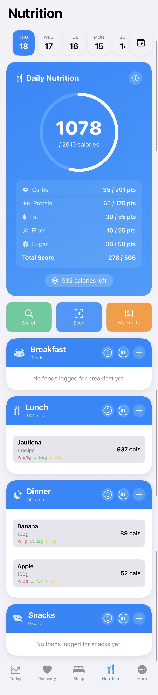
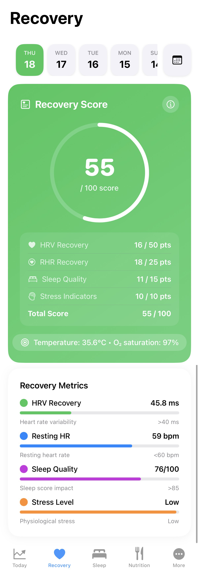
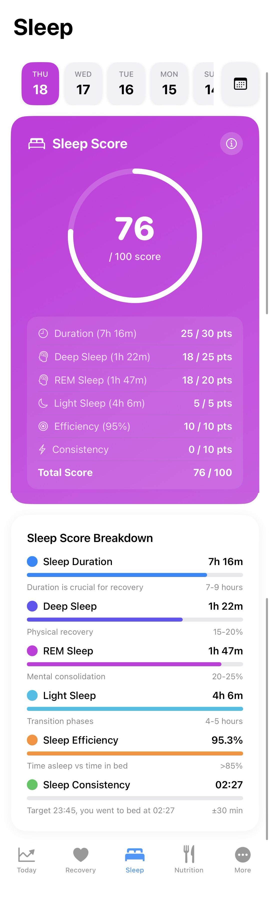
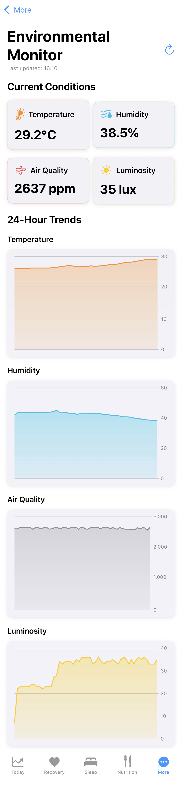
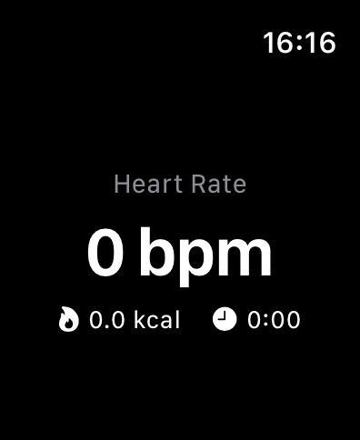

# Wariden

A focused fitness and health companion inspired by ‘warrior in a garden’.

---

## App Preview

- iPhone

  
  
  
  
  

- Apple Watch

  

---

## What is Wariden?

- Fitness, nutrition, recovery, hydration, and sleep tracking
- Quick logging and glanceable metrics on Apple Watch
- Light journaling for mindset and motivation
- Privacy-first; you control Health permissions

---

## Features

- Unified dashboard: Fitness, Nutrition, Recovery, Sleep
- Smart goals and daily summaries
- Barcode scanning and quick add for foods
- Apple Health integration (read/write where allowed)
- Fast, offline-first UX

---

## Privacy

Health data access is optional and clearly explained. You control all permissions.

---

## Note

This repository is a public showcase (README + screenshots) without source code.
